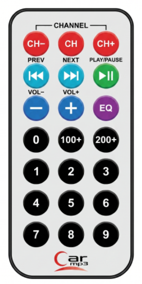

# Car MP3 Infrared (IR) Remote Control



## Description

This is a new ultra-thin 38KHz universal infrared IR Remote Control, NEC encoding format 1-21-key remote control, USB port stereo, car MP3, foot bath, lighting, digital photo frame, microcontroller development board, learning board, etc.

This is a precision 38 kHz Infrared transmitter that uses a MOS integrated circuit with NEC transmission format ideally suited for remote operation in TV, VCD, and all compatible IR receiver devices. The NEC transmission format includes leader codes, customs codes (16 bits), and data codes (16 bits). The frequency of oscillation is determined by the Crystal. The IR LEDs connected to the output emit IR pulses at 38kHz. The circuit is ideal for most IR Sensors since these are designed for 38 kHz pulsed IR rays.

## Infrared (IR) Remote Control Hex Codes
```text
   -----------------------
 /                         \
|   CH-      CH       CH+   |
|   0x45    0x46     0x47   |
|                           |
|  PREV     NEXT  PLAY/PAUSE|
|  |<<      >>|      >||    |
|   0x44    0x48     0x43   |
|                           |
|   VOL-    VOL+      EQ    |                           
|   0x07    0x15     0x09   |
|                           |
|    0      100+     200+   |
|   0x16    0x19     0x0D   |
|                           |
|    1       2        3     |
|   0x0C    0x18     0x5E   |
|                           |
|    4       5        6     |
|   0x08    0x1C     0x5A   |
|                           |
|    7       8        9     |
|   0x42    0x52     0x4A   |
|                           |
|         Car mp3           |
 \                         /
   -----------------------
```

## Specifications

- **Static current:** 3-5 uA
- **Dynamic current:** 3-5 mA
- **Power supply:** Works on CR2025 button batteries, capacity: 160 mAh
- **Working Distance:** More than 8 m (affected by the surrounding environment, receiver sensitivity, etc.)
- **Effective Angle:** 60 degrees
- **Surface materials:** 0.125 pet stick
- **Crystal:** Oscillation frequency of 455 kHz
- **IR carrier frequency:** 38KHz

## Features

- Photodetector and preamplifier in one package
- Internal filter for PCM frequency
- Improved shielding against electrical field disturbance
- TTL and CMOS compatibility
- Output active low
- Low power consumption
- High immunity against ambient light
- Continuous data transmission possible (up to 2400 bps)
- Suitable burst length of ≥ 10 cycles/burst
